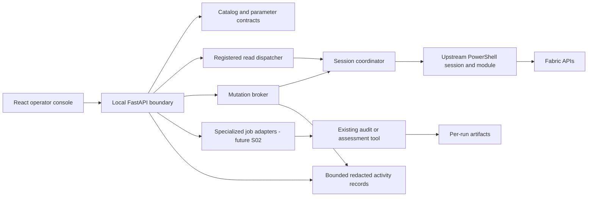

# Product vision and target architecture

## Product outcome

Fabric Ops Studio is a local Windows operations console for a Fabric operator who
needs to understand the tenant, investigate a workspace/item, run established
administrative tools, and make selected changes with a trustworthy audit trail.
Success means fewer repeated portal/terminal steps while keeping the target,
provider, action, result, and uncertainty visible.

The primary journey is: connect → select workspace/item → inspect relevant state
→ preview a registered action → validate/confirm a permitted write → inspect the
verified result and history. Another journey runs an existing specialized audit
and opens its reports without reimplementing the audit logic.

## Feature sequence and why

| Order | Product capability | Why it matters | Completion signal |
|---|---|---|---|
| S01 | Reliable execution and local setup | Operator trust depends on truthful outcomes and correct target binding | Required offline tests pass and lead audits the logic |
| S02 proposed | Security Audit readiness, preview, managed run, reports | Turns an existing high-value investigation into a complete operator workflow | Bounded run lifecycle and original artifacts; explicit auth/live-test evidence |
| S03 proposed | Workspace/item/run drill-down and operational summaries | Lets operators investigate from returned results instead of copying IDs | Context-correct navigation, cancellation of obsolete reads, useful empty/error states |
| S04 proposed | Compatibility diff and upstream maintenance | Prevents new upstream commands or changed semantics silently altering behavior | Added/removed/changed policy/parameter/source report and CI fixtures |
| S05 proposed | Assessment runner and output browser | Reuses migration/readiness analysis with predictable setup and artifacts | Specialized adapter lifecycle and report contract validated |
| Later | Lineage notebook handoff and monitoring entry points | Connects operational investigation to upstream graph/monitoring tools | Accurate prerequisites, context links, output ownership |
| Separate reviews | Selected jobs/schedules/item/Git writes | Removes repetitive work only when validation and outcome semantics are understood | Per-operation decision, verification, blast radius, and negative tests |

S02 onward is sequencing guidance. The lead sizes and authorizes each sprint after
reviewing its predecessor. Workspace roles, capacity assignment, destructive
operations, and analytical authoring are not implicitly enabled by this roadmap.
DAX/model/measure/report/visual authoring remain excluded.

## Architecture shape

Retain the existing React + TypeScript + Fluent UI frontend and FastAPI backend.
Use a single local backend process and one explicitly coordinated Fabric session.
No multi-user service, distributed queue, new database, or framework rewrite is
needed for this product stage.

| Boundary | Current files | Target responsibility |
|---|---|---|
| UI/context | `studio/frontend/src/App.tsx`, pages, workbench | Session/workspace/item identity, operation forms, truthful state, accessibility |
| HTTP/client | `backend/app/main.py`, `frontend/src/api/client.ts` | Client boundary, validated requests, stable errors, run IDs; thin routes |
| Catalog | `backend/app/catalog.py`, `frontend/src/data/capabilities.json`, source registry | Discovery for visibility; curated authorization; shared parameter/endpoint contracts |
| Provider/session | `backend/app/providers/` | Render registered commands; normalize outcomes; serialize session changes and dispatch |
| Mutation broker | `backend/app/mutations.py`, models | Immutable approval snapshot, atomic state transitions, single use, verification |
| Activity | `backend/app/activity.py` | Redacted, bounded start/outcome records; history never restores approval |
| Specialized tooling | `backend/app/specialized_tools.py`, specialized page | Present prerequisites now; separate managed subprocess/artifact lifecycle later |
| Packaging/launcher/CI | `studio/scripts/`, package manifests, Studio workflow | Reproducible local startup and credential-free integration tests |

New small modules may separate parameter validation, endpoint parsing, execution
outcomes, and session coordination. Keep related responsibilities together; no
generic plugin framework or second implementation of Fabric APIs.

## Non-negotiable contracts for S01

1. **Backend is authoritative.** A UI flag, offline catalog entry, or command verb
   does not authorize execution. Unknown capabilities and unreviewed drift default
   to blocked. Verify policy in both routes and provider builders.
2. **Provider outcome differs from domain payload.** Preserve data objects that
   happen to contain an `error` field. Define a Studio-owned versioned envelope
   for invocation status/data/error. Recognize the upstream documented failure
   envelope before accepting success. Empty output, mixed streams, and malformed
   output require operation-specific interpretation. WhatIf returning text is
   not proof of a successful apply or remote permissions validation.
3. **Session identity includes generation.** A plan binds tenant plus a new opaque
   generation on authentication attempt, reconnect, close, process loss/restart.
   A failed reconnect must leave no stale connected status. Validate generation
   at actual dispatch; do not trust an earlier route check. Reads must also carry
   the session/context expectation so queued tenant-A work cannot run in tenant B.
4. **Plan data cannot be edited through responses.** Keep an immutable internal
   snapshot and return detached DTOs. Canonicalize typed values deterministically;
   do not use `default=str` to accept arbitrary objects. Bind capability semantics,
   exact apply/validation commands, verification contract, parameters, tenant,
   session generation, plan ID, and expiry. Recheck before validation and apply.
   A digest is an integrity check, not a signature or standalone authorization.
5. **State claims are atomic.** Under a short broker/per-plan lock claim validation
   or execution; release bookkeeping locks before slow I/O. Completion is accepted
   only for the owning attempt. Establish a single lock order. Session coordination
   may serialize I/O, but list/get/history must not wait for a tenant operation.
6. **No replay after dispatch.** Terminal and in-flight plans cannot apply again.
   Distinguish failed validation, confirmed apply failure, unknown apply outcome,
   verified execution, and applied-but-unverified result. Expiry only prevents new
   dispatch; it cannot relabel an already-running apply. See DECISIONS for states.
7. **Verification compares expected state.** Workspace create uses returned unique
   ID where available; name alone is not identity and duplicates are ambiguous.
   Update verifies requested fields against the specified workspace ID. Missing,
   mismatched, duplicate, or failed read-back cannot become verified success.
   An empty successful update response can still verify successfully by ID.
8. **Shared parameter validation.** Check mandatory/allowed/type values, unknown
   names, and constraints on preview and execution. Distinguish false booleans
   from omitted switches. Unsupported types/parameter sets block that operation
   with an explanation; do not silently coerce or guess. Preserve quoting safety.
9. **Least executable surface.** S01 retains only workspace create/name/description
   update as candidate writes; exclude create's `CapacityId`. Registry discovery
   remains broad but newly discovered reads need reviewed admission (including
   known read verbs whose body may have effects). Keep provenance and file identity.
10. **Local client and audit boundary.** Loopback binding plus explicit allowed
    host/origin checks and a per-launch client credential protect access to the
    shared authenticated runtime. Do not expose a token in URL/history/committed
    bundles/localStorage or a public bootstrap endpoint. Persist structured
    redacted summaries, not arbitrary provider output; bound logs and exports.
11. **UI context is an identity.** Separate editable tenant input from connected
    tenant identity. Invalidate all operation/approval state on context generation
    change. Late responses cannot restore old plans/results. Cancelling a browser
    request does not cancel a server-side write or authorize a retry.

## Future specialized runner contract

S02 uses the existing Security Audit script with allowlisted argv/parameters,
explicit authentication/prerequisites, safeguards retained, no arbitrary command
box, per-run output directories, bounded concurrency/output/runtime, and terminal
run states. Do not assume `-NoPrompt` suppresses authentication: inspect actual
upstream behavior. Display truncation/partial results as such. Cancellation must
address child-process lifetime; it does not mean every external side effect stopped.

Serve artifacts by opaque run/artifact IDs with resolved containment checks,
extension/content/size limits, safe text/Markdown rendering, and original ZIP
download. No arbitrary filesystem browsing or auto-executing report HTML. Preserve
upstream collection logic. Reuse lifecycle abstractions for Assessment only after
the Security Audit vertical slice proves what is shared.
